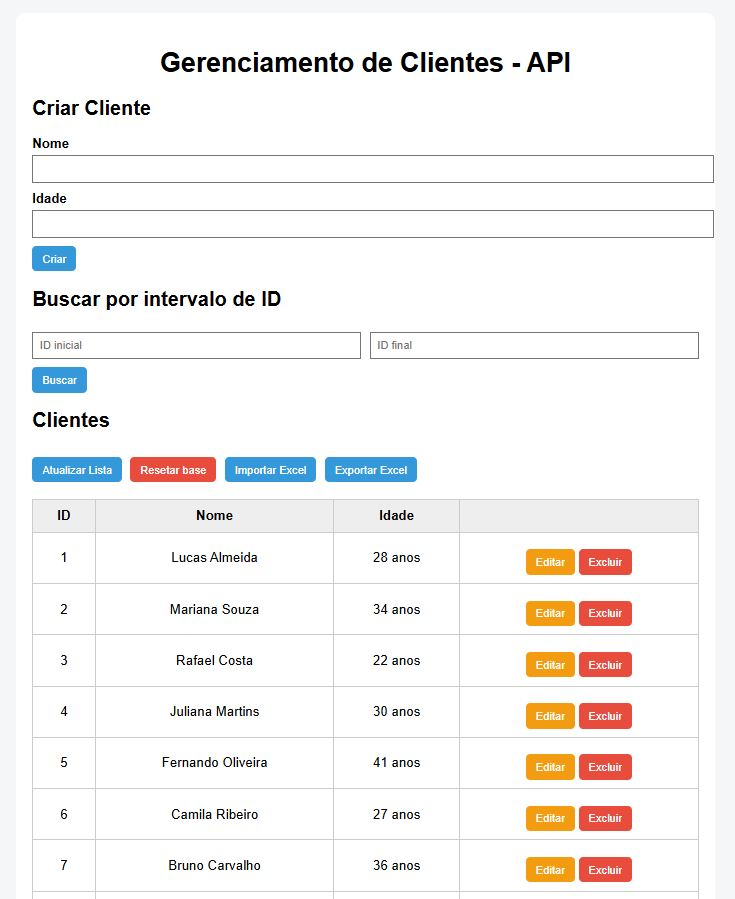
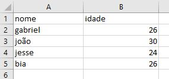
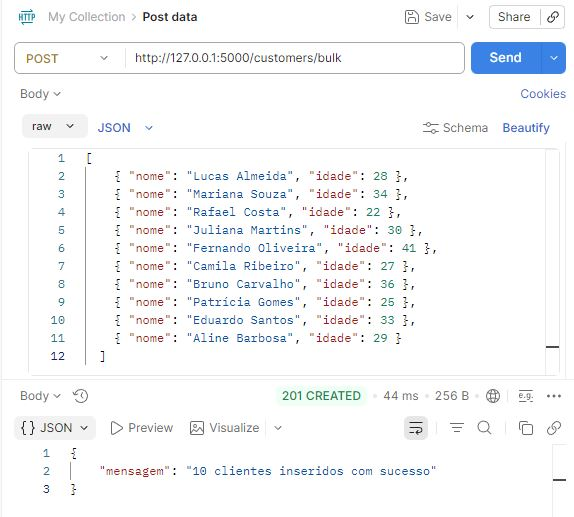

# API de Gerenciamento de Clientes (Flask + MySQL + Docker)

Sistema fullstack para gerenciamento de clientes com API REST em Flask, banco MySQL (Docker) e interface web.

---

## Preview

### Interface Principal

### Tabela de Clientes Que Pode Ser Importado/Exportado
Planilha com as colunas "nome" e "idadde" (ID é auto-incrementado)  

### Testes com Postman

## Principais Endpoints
| Método | Endpoint          | Descrição           |
| ------ | ----------------- | ------------------- |
| GET    | /customers        | Lista clientes      |
| POST   | /customers        | Cria cliente        |
| PUT    | /customers/{id}   | Atualiza cliente    |
| DELETE | /customers/{id}   | Remove cliente      |
| GET    | /customers/range  | Busca por intervalo |
| DELETE | /customers/clear  | Limpa tabela        |
| POST   | /customers/bulk   | Inserção em lote    |
| POST   | /customers/upload | Importar Excel      |
| GET    | /customers/export | Exportar Excel      |

---

## Diferenciais do projeto  
* Integração completa frontend + backend  
* Manipulação de arquivos Excel  
* Uso de Docker para banco de dados  
* API REST estruturada  
* Projeto organizado e escalável  

---

## Funcionalidades

- ✅ Criar cliente  
- ✅ Listar clientes  
- ✅ Atualizar cliente  
- ✅ Deletar cliente  
- ✅ Buscar clientes por intervalo de ID  
- ✅ Resetar base de dados  
- ✅ Inserção em lote (bulk)  
- ✅ Importar clientes via Excel (.xlsx)  
- ✅ Exportar clientes para Excel  

---

## Arquitetura
Backend (Flask API)  
        ↓  
Frontend (HTML + JS)  
        ↓  
Banco de Dados (MySQL - Docker)

---

## Tecnologias Utilizadas
Python  
Flask  
MySQL  
Docker  
Postman  
JavaScript  
HTML / CSS  
Pandas (importação/exportação Excel)

---

## Como Rodar (resumo)

**Clonar repositório**  
git clone https://github.com/seu-usuario/customer-management-system.git

**Criar ambiente virtual**  
python -m venv .venv  
.venv\Scripts\activate

**Instalar dependências**  
pip install -r requirements.txt

**No terminal**:  
python app.py  
python -m http.server 8000

**Acesse:**  
http://127.0.0.1:8000/frontend

---

## Autor

Gabriel Campanha
